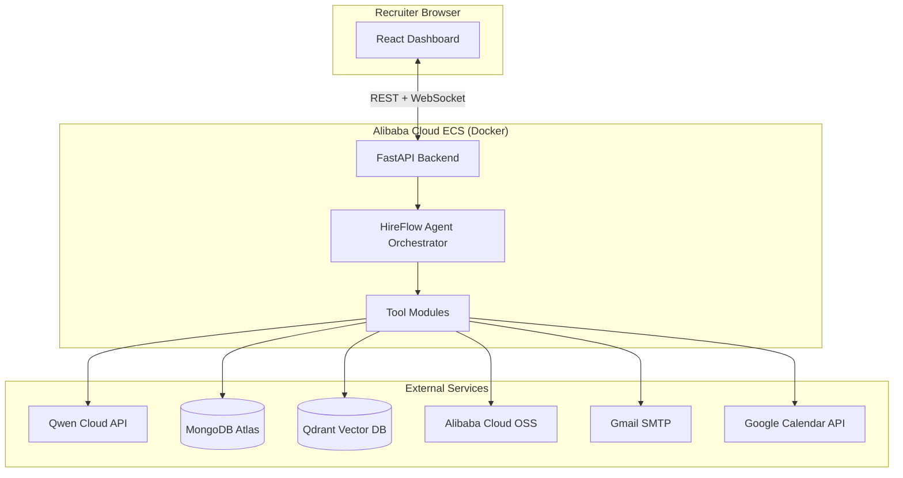

# HireFlow AI — System Architecture

```mermaid
flowchart TB
    subgraph Client["Recruiter Browser"]
        UI[React Dashboard]
    end
    subgraph AlibabaCloud["Alibaba Cloud ECS (Docker)"]
        API[FastAPI Backend]
        AGENT[HireFlow Agent Orchestrator]
        TOOLS[Tool Modules]
    end
    subgraph ExternalServices["External Services"]
        QWEN[Qwen Cloud API]
        MONGO[(MongoDB Atlas)]
        QDRANT[(Qdrant Vector DB)]
        OSS[Alibaba Cloud OSS]
        GMAIL[Gmail SMTP]
        GCAL[Google Calendar API]
    end
    UI <-->|REST + WebSocket| API
    API --> AGENT
    AGENT --> TOOLS
    TOOLS --> QWEN
    TOOLS --> MONGO
    TOOLS --> QDRANT
    TOOLS --> OSS
    TOOLS --> GMAIL
    TOOLS --> GCAL
```